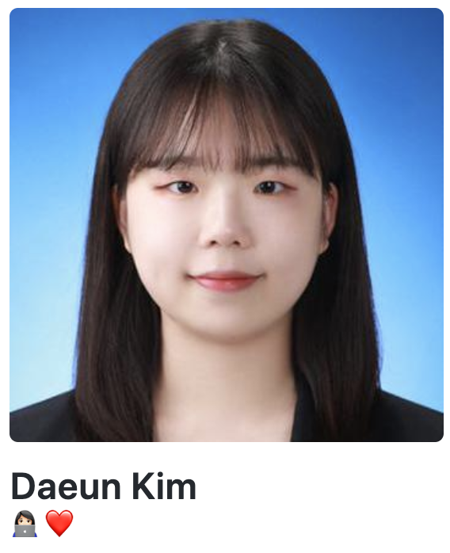

# 경력
- 쎄트렉아이 계약 근무
    - 부서: 지상 3팀
    - 업무: Angular 기반 사내 웹 애플리케이션 개발
    - 기간: 2018.09.10 ~ 2018.12.21

- 쎄트렉아이 인턴
    - 부서: 지상 3팀
    - 업무: Spring 기반 사내 웹페이지 한/영 전환 기능 개발 / OpenLayers를 활용한 웹 애플리케이션 개발
    - 기간: 2018.06.21 ~ 2018.08.16

# 활동 내역

# 수상 내역
- 국립중앙과학관 무한상상실 아이디어클럽
    - 수상 내역: 제작비 지원(150만원) 및 시제품 개발
    - 수상 일자: 2016.10.14
    - 주관: 국립중앙과학관
    - 설명: 아두이노와 안드로이드 애플리케이션 간의 Wi-Fi 통신을 활용한 프로젝트

- 2016 창의 SW축전 DevDay
    - 수상 내역: 대상
    - 수상 일자: 2016.11.25
    - 주관: 충남대학교 소프트웨어연구소
    - 설명: 알고리즘 경진대회

- 2016 창의 SW축전 창의작품 경진대회
    - 수상 내역: 장려상
    - 수상 일자:
    - 주관: 충남대학교 소프트웨어연구소
    - 설명: 아두이노와 안드로이드 애플리케이션 간의 Wi-Fi 통신을 활용한 프로젝트

- 제2회 주니어 창의작품 경진대회
    - 수상 내역: 대상
    - 수상 일자: 2017.01.23
    - 주관: 충남대학교 SW중심대학사업단
    - 설명: 웹 크롤러를 활용한 텔레그램 봇 출품

- 2018 평창 동계올림픽 기념 SW 공모전
    - 수상 내역: 장려상
    - 수상 일자: 2017.11.24
    - 주관: 미래창조과학부
    - 설명: 올림픽 지식 제공 안드로이드 애플리케이션 출품

- 2019 CNU Engineering Fair 캡스톤 디자인, 졸업작품 경진대회
    - 수상 내역: 우수상
    - 수상 일자: 2019.09.26
    - 주관: 충남대학교 공과대학
    - 설명: DDS, 패턴분석을 활용한 전기차 충전소 모니터링 시스템

- 2019 창의 SW축전 창의작품 경진대회
    - 수상 내역: 장려상
    - 수상 일자: 2019.11.22
    - 주관: 충남대학교 소프트웨어연구소
    - 설명: DDS, 패턴분석을 활용한 전기차 충전소 모니터링 시스템

# 프로젝트

# 자격증
- SQLD
- ISTQB
- 정보처리기사

# 활용 가능 언어 및 도구
- JAVA
- C
- C++
- Python
- Angular
- HTML, Javascript, CSS
- Android Studio

### More Information

<https://www.linkedin.com/in/daeun-kim-16559b14a>

### Contact me

[kde0820@naver.com](mailto:kde0820@naver.com)